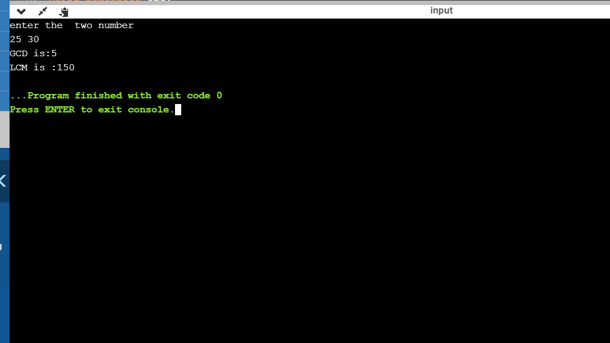

#Experiment 1

##Aim of the Experiment
To implement data link layer framing techniques such as
i. Character count ii. Character stuffing and iii. bit stuffing

### step by step procedure of experiment
1.
2.
3.
4.

### Output

