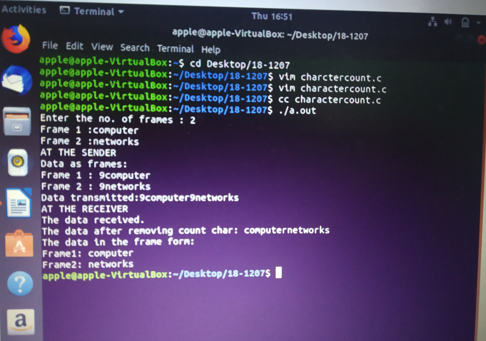
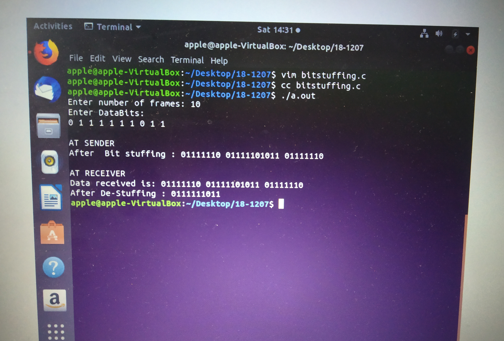
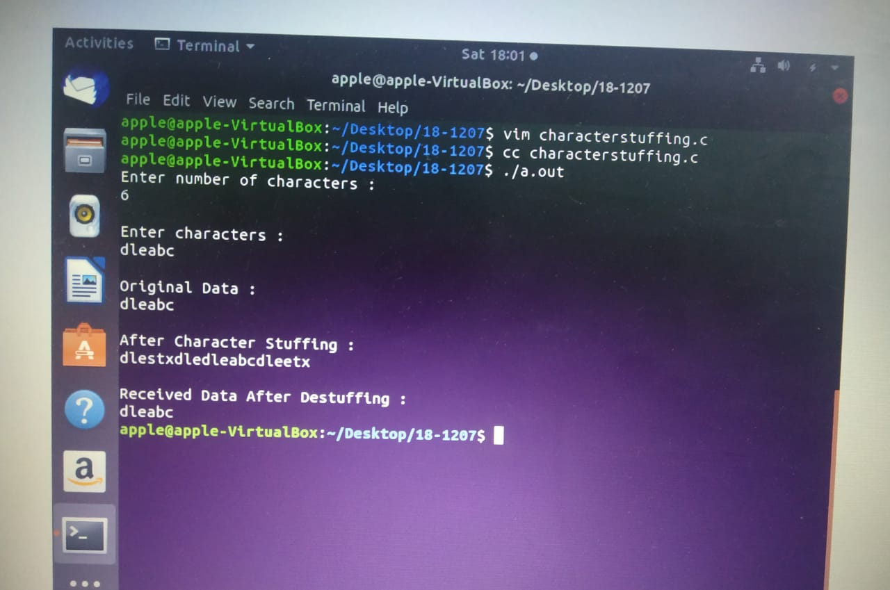

# Experiment 1

## Aim of the Experiment
To implement data link layer framing techniques such as
i. Character count 
ii. Character stuffing and
iii. bit stuffing

### step by step procedure of experiment
### For character count
1.Enter number of frames
2.print the data as frames
3.Find the string length of each frame
4.print the data both at sender side and Receiver side
### For Bit Stuffing
1.Take the input as number of frames
2.Enter Databits 
3.Apply the bitstuffing logic at the sender side.
4.Destuff the bits at the receiver side and print the output 
### For Stuffing
1.Take the input characters size based on the input size enter character data. 
2.print the original data
3.Apply the character stuffing logic at the sender side and print the data
4.At the receiver side destuff the stuffed data and print the output

### Output

